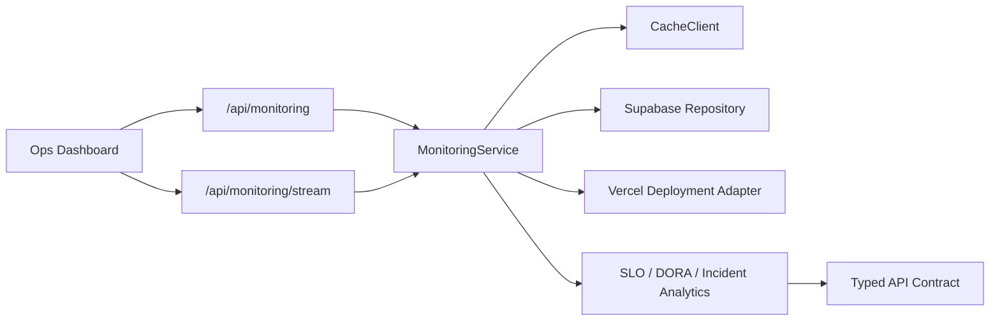

# DevOps Deployment Monitoring Platform

[](https://devops-monitoring-dashboard-psi.vercel.app)
[](https://devops-monitoring-dashboard-psi.vercel.app)
[](#verification)

A production-minded cloud operations dashboard built as a DevOps / Platform Engineering portfolio case study. It demonstrates deployment monitoring, SRE-style observability, typed API contracts, CI/CD workflows, cloud adapters, and operational UI patterns.

## Live Demo

Production: [https://devops-monitoring-dashboard-psi.vercel.app](https://devops-monitoring-dashboard-psi.vercel.app)

Healthcheck: [https://devops-monitoring-dashboard-psi.vercel.app/api/health](https://devops-monitoring-dashboard-psi.vercel.app/api/health)

The production deployment uses demo telemetry by default, so it is safe to share publicly. Vercel Web Analytics is enabled for lightweight traffic visibility.

## Screenshots

Desktop command center:


Mobile operations layout:


## What This Demonstrates

- Next.js 16 App Router platform architecture.
- Typed DTOs and structured API response contracts.
- Repository pattern for Supabase telemetry and Vercel deployment data.
- Service layer for monitoring snapshot orchestration.
- Zod-backed environment validation.
- Structured JSON logging and request trace IDs.
- Rate limiting, API-key guard, RBAC simulation, and audit logs.
- SSE live updates with polling fallback.
- SLOs, error budget burn, incidents, MTTR, DORA metrics, region health, dependency health, and anomaly simulation.
- GitHub Actions CI, preview deploy, production deploy, Docker packaging, and health checks.

## Tech Stack

- Next.js 16 + React 19
- TypeScript
- Recharts
- Supabase JavaScript client
- Vercel Deployments API adapter
- Zod
- Vitest + ESLint
- Docker + GitHub Actions

## Architecture



Important folders:

- `src/app`: routes, API endpoints, loading and error boundaries.
- `src/components`: command center and dashboard panels.
- `src/features/monitoring`: SRE analytics and monitoring logic.
- `src/hooks`: retry-aware fetch and SSE live updates.
- `src/server`: env validation, logger, API contracts, auth, cache, services, repositories.
- `src/types`: shared DTOs and response contracts.
- `docs`: architecture, deployment, observability, rollback, and scaling docs.

## Local Development

```bash
npm ci
npm run dev
```

Open `http://localhost:3000`.

The project works without cloud credentials by using demo telemetry, which makes it easy for recruiters and hiring managers to review.

## Verification

```bash
npm run lint
npm run typecheck
npm test
npm run audit:prod
npm run build
```

Or run everything:

```bash
make verify
```

## Optional Cloud Configuration

Copy `.env.example` to `.env.local`.

```bash
VERCEL_API_TOKEN=
VERCEL_PROJECT_ID=
VERCEL_TEAM_ID=

SUPABASE_URL=
SUPABASE_SERVICE_ROLE_KEY=

MONITORING_API_KEY=
MONITORING_REQUIRE_API_KEY=false

UPSTASH_REDIS_REST_URL=
UPSTASH_REDIS_REST_TOKEN=
```

## Supabase Tables

```sql
create table service_metrics (
  id text primary key,
  name text not null,
  region text not null,
  environment text not null default 'production',
  uptime numeric not null,
  slo_target numeric not null default 99.9,
  p95_latency_ms integer not null,
  error_rate numeric not null,
  requests_per_minute integer not null,
  cpu_load integer not null,
  memory_load integer not null,
  dependencies text[] default '{}',
  updated_at timestamptz not null default now()
);

create table deployment_logs (
  id text primary key,
  timestamp timestamptz not null default now(),
  service text not null,
  level text not null check (level in ('info', 'warn', 'error', 'debug')),
  message text not null,
  request_id text not null,
  trace_id text
);
```

## CI/CD

The repository includes:

- `.github/workflows/ci.yml`: lint, typecheck, tests, production audit, build, Docker build.
- `.github/workflows/preview.yml`: pull request preview deployment flow.
- `.github/workflows/deployment.yml`: protected production deployment flow.

The pipeline models common platform engineering gates: correctness, dependency hygiene, build reproducibility, preview review, and production promotion.

## Docker

```bash
docker build -t devops-monitoring-dashboard .
docker run --rm -p 3000:3000 devops-monitoring-dashboard
```

The image uses a multi-stage build, non-root runtime user, Next standalone output, and `/api/health` health checks.

## Engineering Decisions

- Demo telemetry stays built in so the portfolio remains reviewable without secrets.
- Cloud integrations are adapters, not hard-coded dashboard dependencies.
- SSE is used before WebSockets because updates are one-way and lightweight.
- API responses are enveloped so errors, cache status, role, and trace IDs are consistent.
- Redis is abstracted through `CacheClient`; local development uses memory cache, production can use Upstash REST.
- UI prioritizes operator questions: health, bottleneck, what changed, what action to take.

## Production Readiness Checklist

- [x] Typed contracts and DTOs
- [x] Environment validation
- [x] Healthcheck endpoint
- [x] Structured logging
- [x] Request tracing
- [x] API rate limiting
- [x] API-key protection path
- [x] RBAC simulation
- [x] Audit log capture
- [x] SLO and error-budget tracking
- [x] CI/CD workflows
- [x] Docker packaging
- [x] Rollback strategy docs
- [x] Scaling strategy docs

## Documentation

- [Architecture](docs/architecture.md)
- [Observability Strategy](docs/observability.md)
- [Deployment Guide](docs/deployment.md)
- [Data Flow](docs/data-flow.md)
- [Incident Simulation](docs/incident-simulation.md)
- [Supabase Setup](docs/supabase-setup.md)
- [Rollback Strategy](docs/rollback-strategy.md)
- [Scaling Strategy](docs/scaling.md)
