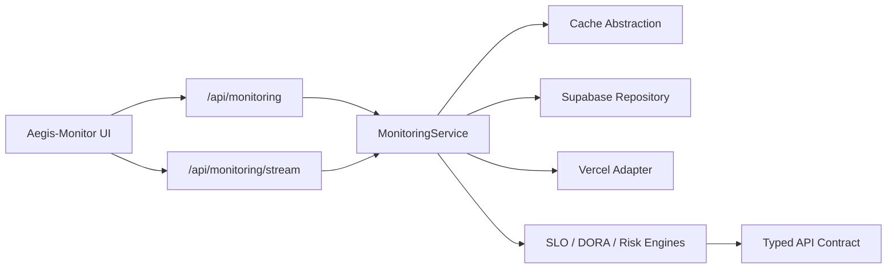
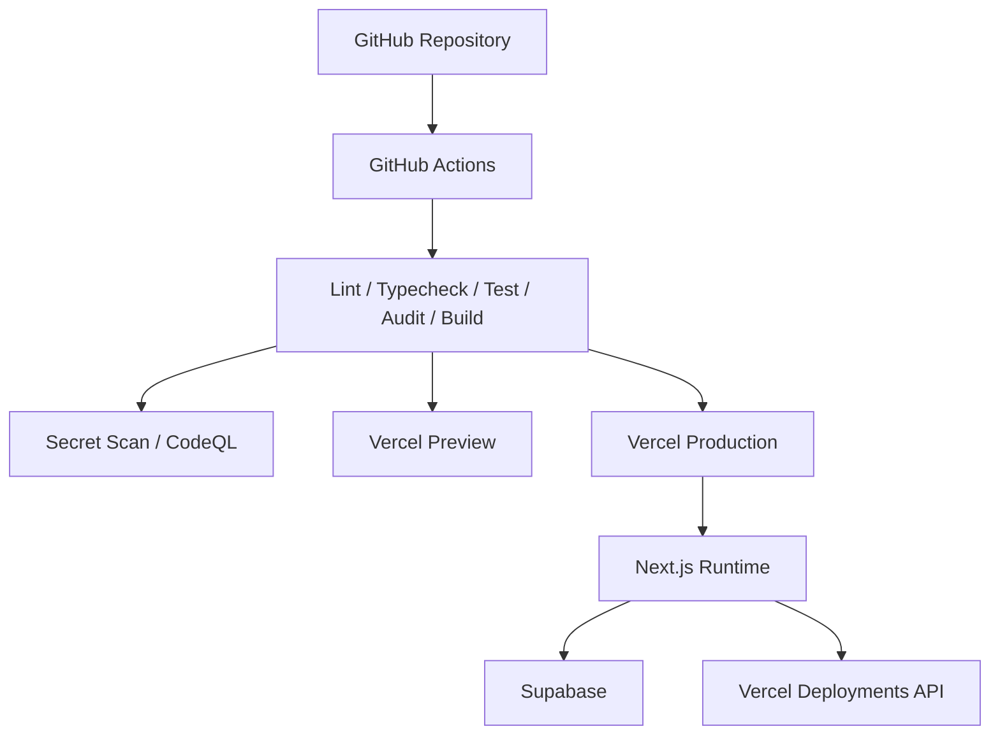
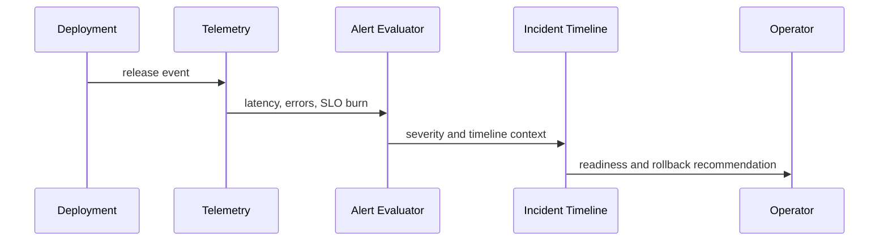

# Aegis-Monitor

[](https://devops-monitoring-dashboard-psi.vercel.app)
[](https://devops-monitoring-dashboard-psi.vercel.app)
[](#security-considerations)

Aegis-Monitor is a production-minded cloud operations and deployment observability console. It brings release health, service telemetry, incident context, SLO burn, deployment risk, and CI/CD visibility into one internal platform-style dashboard.

Live: [https://devops-monitoring-dashboard-psi.vercel.app](https://devops-monitoring-dashboard-psi.vercel.app)  
Healthcheck: [https://devops-monitoring-dashboard-psi.vercel.app/api/health](https://devops-monitoring-dashboard-psi.vercel.app/api/health)

The healthcheck is a readiness endpoint: it validates the runtime environment and confirms configured telemetry dependencies are reachable.

## Product Overview

Aegis-Monitor models the kind of internal reliability console a platform team would use to answer three operational questions:

- Is production healthy?
- Did the latest deployment make things worse?
- Should the team watch, rollback, or keep releasing?

The platform supports Supabase seed telemetry and the Vercel Deployments API, with demo fallbacks so the project remains reviewable when private integrations are unavailable.

## Why This Project Exists

This project is built as a DevOps, SRE, and platform engineering portfolio case study. It demonstrates more than charts: typed service boundaries, CI/CD gates, operational telemetry, incident response flow, release confidence, and production-readiness thinking.

## Architecture Overview



Key folders:

- `src/app`: Next.js routes, API handlers, healthcheck, loading, and error boundaries.
- `src/components`: command center, service panels, incident views, charts, and release intelligence UI.
- `src/features/monitoring`: SRE analytics, alert evaluation, deployment risk, and chart transformations.
- `src/server`: env validation, logger, auth, rate limiting, repositories, services, cache, tracing, and API response contracts.
- `src/types`: shared DTOs used by the API, UI, and tests.

## Infrastructure Design



GitHub Actions owns verification, security scanning, preview deployment, and production deployment. Vercel hosts the app. Supabase stores service metrics and log events. Provider details stay behind server-side adapters.

## Observability Philosophy

A green build is not the same as a healthy release. Aegis-Monitor treats deployment health as a combined signal across:

- SLOs and SLIs
- error budget remaining
- burn-rate alerts
- p95 latency and error rate
- regional service health
- dependency graph health
- incident lifecycle state
- deployment risk and release confidence

See [Observability Strategy](docs/observability.md).

## CI/CD Pipeline

Workflows:

- `.github/workflows/ci.yml`: lint, typecheck, unit tests, production audit, build, Docker build.
- CI also runs Playwright smoke tests against a production build to verify the dashboard render path and SSE environment streaming.
- `.github/workflows/security.yml`: committed-secret scan, dependency audit, CodeQL.
- `.github/workflows/preview.yml`: pull request preview deployment.
- `.github/workflows/deployment.yml`: production deployment through Vercel.
- `.github/workflows/supabase-heartbeat.yml`: scheduled telemetry refresh for Supabase-backed monitoring data.

The production pipeline is configured with GitHub Actions secrets and has completed successfully.

## Monitoring Strategy

The monitoring API returns a structured snapshot consumed by polling and Server-Sent Events. It combines:

- Supabase service metrics and logs.
- Vercel deployment history.
- SLO, DORA, incident, readiness, and deployment-risk analytics.
- Safe fallback telemetry when integrations are unavailable.

## Incident Response Flow



Incident views include severity, owner, timeline events, related logs, deployment correlation, and rollback intelligence.

## Scalability Strategy

The current implementation is intentionally compact, but the boundaries are production-shaped:

- Replace in-process queue simulation with durable event ingestion.
- Move high-cardinality logs to a purpose-built log store.
- Keep Supabase for relational incident, deployment, and configuration data.
- Precompute 24h, 7d, and 30d analytical windows.
- Replace memory cache with Redis or Upstash REST.
- Add tenant-aware authorization before multi-team use.

See [Scaling Strategy](docs/scaling.md) and [Telemetry Retention](docs/telemetry-retention.md).

## Security Considerations

Implemented:

- Zod environment validation.
- Server-only Supabase service-role usage.
- API response envelopes and request trace IDs.
- Rate limiting, API-key guard support, RBAC simulation, and audit logs.
- GitHub security workflow with secret scanning, dependency audit, and CodeQL.
- Local committed-secret scanner.

Security audit: [docs/security-audit.md](docs/security-audit.md)

## Local Development

```bash
npm ci
npm run dev
```

Open `http://localhost:3000`.

Optional runtime configuration lives in `.env.local`. Keep secrets out of Git.

## Production Deployment

Production is deployed on Vercel:

[https://devops-monitoring-dashboard-psi.vercel.app](https://devops-monitoring-dashboard-psi.vercel.app)

Required GitHub Actions secrets:

- `VERCEL_TOKEN`
- `VERCEL_ORG_ID`
- `VERCEL_PROJECT_ID`

Runtime integrations:

- `APP_NAME`
- `SUPABASE_URL`
- `SUPABASE_SERVICE_ROLE_KEY`
- `NEXT_PUBLIC_SUPABASE_URL`
- `NEXT_PUBLIC_SUPABASE_ANON_KEY`
- `VERCEL_API_TOKEN`
- `VERCEL_TEAM_ID`
- `VERCEL_PROJECT_ID`

## Screenshots

Desktop command center:


Mobile operations layout:


## Architecture Diagrams

- [Architecture](docs/architecture.md)
- [Data Flow](docs/data-flow.md)
- [Deployment Topology](docs/deployment-topology.md)
- [Event Aggregation Pipeline](docs/event-aggregation-pipeline.md)

## Engineering Tradeoffs

Aegis-Monitor favors believable production patterns over fake enterprise complexity.

- [Architecture Decision Records](docs/adr/README.md)
- [Engineering Tradeoffs](docs/tradeoffs.md)
- [Rollback Strategy](docs/rollback-strategy.md)
- [Synthetic Postmortem](docs/postmortems/2026-05-17-synthetic-billing-webhook.md)

## Verification

```bash
npm run verify
npm run audit:prod
```

`npm run verify` runs linting, TypeScript, unit tests, secret scanning, dependency audit, and production build.

## Future Enhancements

- Persist incident lifecycle state transitions.
- Add authenticated alert acknowledgement and rollback commands.
- Add synthetic probes from multiple regions.
- Add tenant-scoped projects and service ownership.
- Add long-term SLO reporting.
- Add OpenTelemetry export compatibility.
- Execute the [major dependency upgrade plan](docs/major-upgrade-plan.md).
