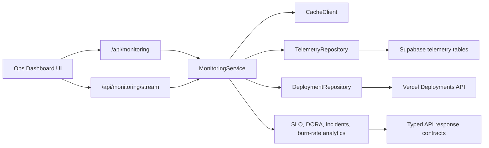

# Architecture

This project is structured like a small internal developer platform rather than a single dashboard page.

## Layers

- `src/app`: Next.js routes, API entrypoints, loading/error boundaries.
- `src/components`: reusable dashboard and operations UI surfaces.
- `src/features/monitoring`: SRE analytics, alert evaluation, chart-ready transformations.
- `src/hooks`: browser-side telemetry fetching, retries, and SSE subscription.
- `src/server`: environment validation, logger, API contracts, auth, cache, repositories, services.
- `src/types`: shared DTOs and API contracts.

## Runtime Flow

1. The browser requests `/api/monitoring`.
2. The route assigns a trace ID and optionally enforces an API key.
3. The route applies rate limiting and records an audit event.
4. `MonitoringService` reads from cache, Supabase, Vercel, or demo fallbacks.
5. Analytics compute SLO burn, DORA metrics, regions, dependencies, incidents, and anomalies.
6. The route returns a typed `{ ok, data, meta }` response with trace metadata.
7. The UI continues receiving updates through SSE when live mode is enabled.

## Production Choices

- Demo telemetry is always available so the portfolio can be reviewed without secrets.
- Supabase and Vercel adapters are isolated behind repository interfaces.
- API responses are enveloped so clients can handle success, errors, cache state, role, and trace IDs consistently.
- SSE is used for lightweight realtime updates without introducing a full WebSocket service.
- The Redis cache abstraction supports Upstash REST when configured and falls back to in-memory cache locally.
