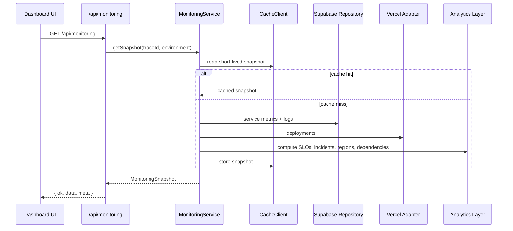

# Data Flow

The dashboard is designed around a predictable monitoring snapshot contract.



## Contract

All monitoring responses use:

```ts
type ApiResponse<T> =
  | { ok: true; data: T; meta: ApiMeta }
  | { ok: false; error: ApiErrorPayload; meta: ApiMeta };
```

The UI can rely on:

- `ok` for success or failure.
- `data` only when `ok` is true.
- `meta.traceId` for log correlation.
- `meta.cache` for cache visibility.
- `meta.role` for RBAC simulation.

## Graceful Degradation

If Supabase or Vercel credentials are missing, the service falls back to demo telemetry. This keeps the production demo shareable while preserving the same response shape a real integration would use.
