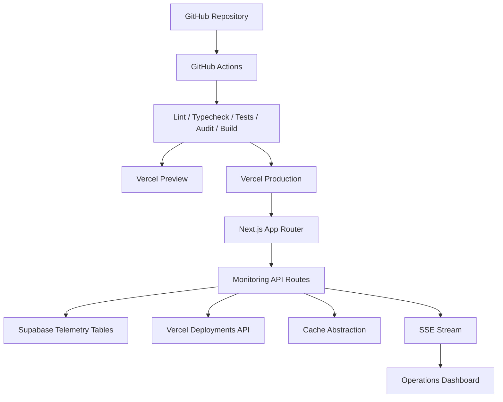

# Deployment Topology

The topology is intentionally small but production-shaped. GitHub Actions owns verification, Vercel owns runtime delivery, Supabase stores seed telemetry, and the application owns analytics, alert evaluation, and response contracts.

## Environments

- `production`: stable public portfolio deployment.
- `preview`: pull request review deployments.
- `development`: local operator workflow with `.env.local`.

## Isolation

Environment variables are scoped in Vercel for production, preview, and development. Supabase service-role access is server-only. Public anon configuration is safe only for read-only surfaces protected by row-level security.
