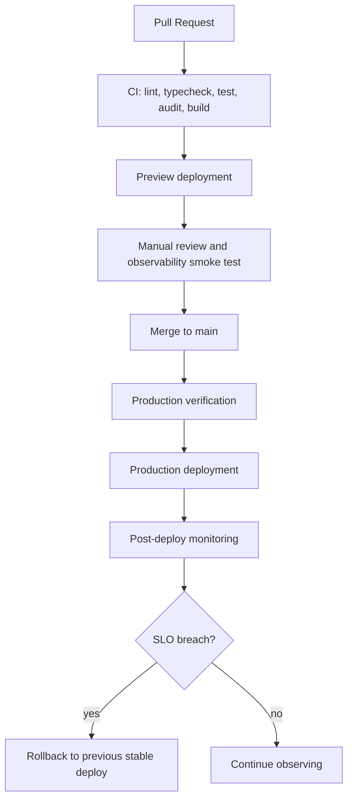

# Aegis-Monitor Deployment Guide

Production URL: [https://devops-monitoring-dashboard-psi.vercel.app](https://devops-monitoring-dashboard-psi.vercel.app)

Healthcheck URL: [https://devops-monitoring-dashboard-psi.vercel.app/api/health](https://devops-monitoring-dashboard-psi.vercel.app/api/health)

## Local Development

```bash
npm ci
npm run dev
```

## Verification Gates

```bash
npm run lint
npm run typecheck
npm test
npm run audit:prod
npm run build
npm run test:e2e
```

Or:

```bash
make verify
```

## Vercel Deployment

The project includes `vercel.json` with `framework: "nextjs"` so Vercel serves the Next.js build output correctly even if project settings were initially created as `Other`.

Required GitHub secrets for the preview and production workflows:

- `VERCEL_TOKEN`
- `VERCEL_ORG_ID`
- `VERCEL_PROJECT_ID`

Optional application secrets:

- `APP_NAME`
- `VERCEL_API_TOKEN`
- `SUPABASE_URL`
- `SUPABASE_SERVICE_ROLE_KEY`
- `NEXT_PUBLIC_SUPABASE_URL`
- `NEXT_PUBLIC_SUPABASE_ANON_KEY`
- `MONITORING_API_KEY`
- `UPSTASH_REDIS_REST_URL`
- `UPSTASH_REDIS_REST_TOKEN`

`/api/health` is a readiness check. It returns `degraded` when Supabase is configured but unreachable, and `ok` when Supabase is either reachable or intentionally not configured.

Vercel Web Analytics is enabled on the project for lightweight production usage visibility.

## Docker

```bash
docker build -t aegis-monitor .
docker run --rm -p 3000:3000 aegis-monitor
```

The image uses a multi-stage build, runs as a non-root user, and checks `/api/health`.

## Deployment Architecture


