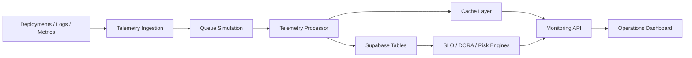

# Event Aggregation Pipeline

## Processor Responsibilities

- Normalize service, region, and environment labels.
- Attach trace IDs to API responses.
- Calculate SLO burn, incident severity, and deployment confidence.
- Convert provider-specific deployment records into shared DTOs.
- Keep fallback telemetry compatible with production response contracts.

## Scaling Path

The current queue is simulated in-process. A production version would move ingestion to a durable queue, push workers into a separate runtime, and write pre-aggregated telemetry windows for low-latency dashboard reads.
